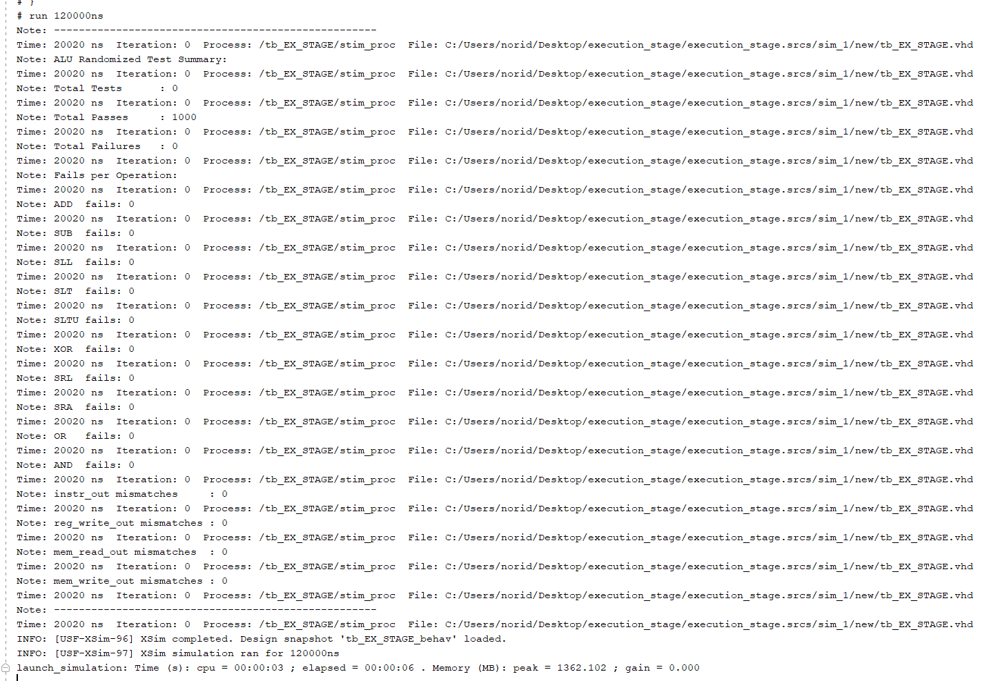
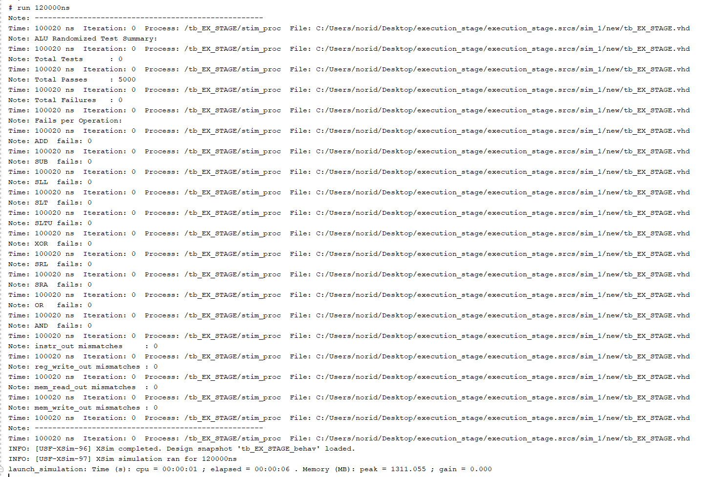
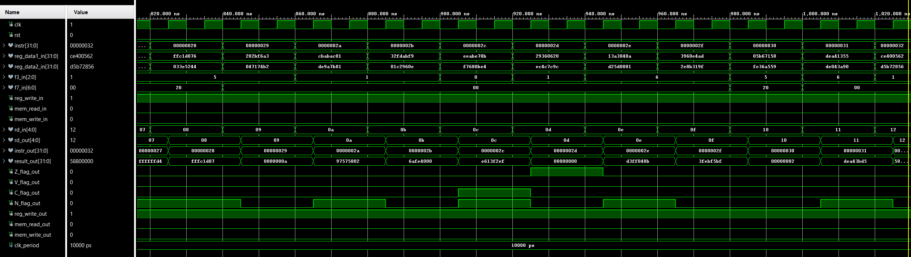
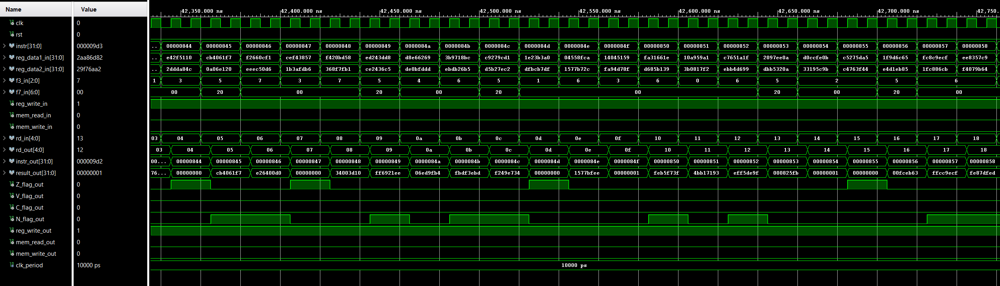

# EX_STAGE

## Overview
The **EX_STAGE** module represents the Execution stage of a 5-stage pipelined RISC-V CPU. It performs all arithmetic and logic operations using an ALU and passes the results, flags, and control signals to the MEM stage. It registers all inputs and outputs to support stable pipeline progression, forwarding, and hazard detection in future extensions.

## Features
- Interfaces directly with the ALU for performing R-type and I-type operations
- Supports all RISC-V ALU operations using funct3 and funct7
- Computes result and sets condition flags (Z, V, C, N)
- Registers all outputs including instruction and control signals (mem_read, mem_write, reg_write)
- Prepares data and control handoff to the MEM stage through EX/MEM pipeline registers

## Project Structure
**EX_STAGE**/
- images/
    - tcl_5000cases.png
    - tcl_1000cases.png
    - wave_1000cases.png
    - wave_5000cases.png
- src/
    - EX_STAGE.vhd
    - adder_32bits.vhd
    - ALU_32bits.vhd
    - FullAdder.vhd
    - FullSubtractor.vhd
    - sub_32bits.vhd
- test_benches/
    - tb_EX_STAGE.vhd
- .gitignore/
- README.md/

## Testbench Strategy
The testbench uses randomized testing to evaluate all supported ALU operations over 5000 input cases. It:
- Randomly generates inputs for operands A and B, funct3, and funct7
- Calculates expected output in software and compares it with hardware ALU output
- Validates instruction passthrough and control signal propagation (reg_write, mem_read, mem_write)
- Tracks test statistics including per-operation failure counts and signal mismatches
- Provides clear feedback through the Tcl Console for debugging

## Key Learnings
- Gained hands-on experience designing and testing a pipelined CPU execution stage
- Learned how to manage control signal registration across pipeline boundaries
- Improved understanding of condition flag handling and ALU operation decoding
- Applied effective testbench strategies using randomized and edge-case generation
- Reinforced the importance of modular design for future extensions (hazard detection, forwarding, etc.)

## Simulation Results
### Tcl Console Output
  
  
*1000 and 5000 randomized tests passed with no failures. All control and data signals behaved as expected.*
### Waveform Example
  
  
*Waveform shows result_out, flag outputs, and correct instruction/control signal propagation from EX to MEM stage.*

## How to Run
1. Launch **Vivado 2019** or newer
2. Open the project or create a new one and add the src and a test bench file.
3.  Set `tb_EX_STAGE.vhd` as the top-level simulation unit.
4. Run the simulation:
    - Go to Flow → Run Simulation → Run Behavioral Simulation
    - Or use the project manager's simulation shortcut.
    - Increase the simulation runtime if needed to capture full behavior.
5. View signals in the Waveform Viewer and test status in the Tcl Console.

## Author
**Noridel Herron** (@MIZZOU)  
Senior in Computer Engineering  
noridel.herron@gmail.com

## Contributing
This is a personal academic project. Suggestions, issues, and improvements are welcome through GitHub.

## License
MIT License

## Disclaimer
This project is developed solely for educational and personal learning purposes.  
It may contain unfinished or experimental features and is not intended for commercial or production use.
